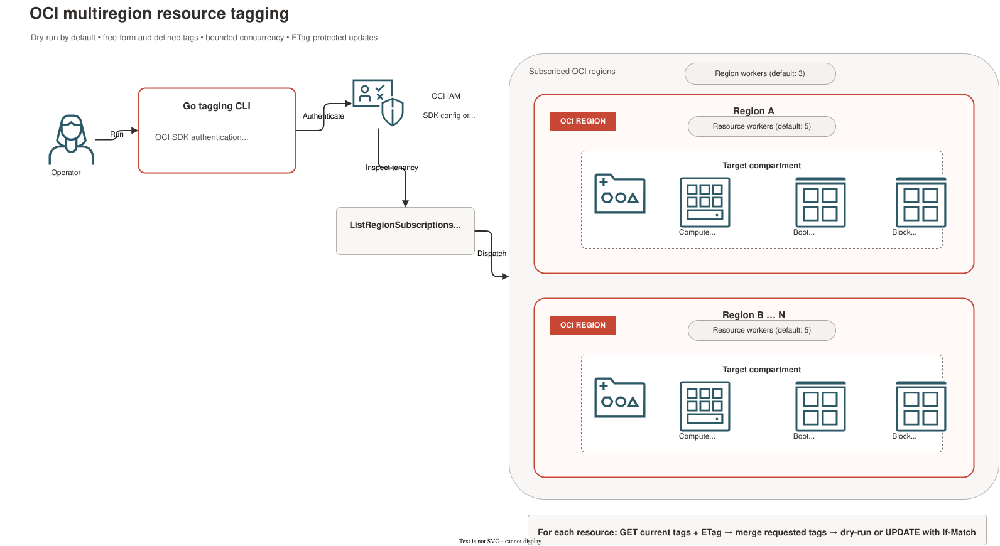

# OCI Multiregion Resource Tagger

Apply free-form tags, nested or flattened defined tags, or any combination of them to OCI Compute instances, boot volumes, and block volumes in one compartment across every subscribed region in `READY` state.

> This project is independent and is not affiliated with, endorsed by, or supported by Oracle or any Oracle product team.

The program is safe to inspect before use: it defaults to dry-run mode, preserves existing tags, skips terminating resources, uses ETags to protect concurrent changes, and limits API concurrency through configurable worker pools.



## What it tags

For the specified compartment, the program discovers and processes these resources in every subscribed OCI region whose subscription status is `READY`:

| Resource | OCI SDK operations |
| --- | --- |
| Compute instances | `ListInstances`, `GetInstance`, `UpdateInstance` |
| Boot volumes | `ListBootVolumes`, `GetBootVolume`, `UpdateBootVolume` |
| Block volumes | `ListVolumes`, `GetVolume`, `UpdateVolume` |

The compartment itself is global, but the resources are regional. Child compartments are not traversed.

By default, each invocation processes all three resource types in that compartment across all `READY` regions. Use `-compute`, `-boot-volumes`, and `-block-volumes` to select one or more types. These flags do not select an individual resource OCID.

## Behavior

- Existing free-form and defined tags are retained.
- A supplied value replaces an existing value only when the namespace/key or free-form key matches.
- Defined-tag namespaces and tag definitions must already exist.
- Flattened defined-tag input uses `namespace.key` references and is converted to the nested structure required by the OCI SDK.
- When the same defined tag is supplied more than once, precedence is `-flattened-tag`, then `-flattened-tags`, then `-defined-tags`.
- The program does not create, rename, or delete tag namespaces or tag definitions.
- `TERMINATING` and `TERMINATED` resources are skipped.
- Dry-run is the default. The `-apply` flag is required to make changes.
- If any resource selection flag is provided, unselected resource types are not listed or updated. Without a resource selection flag, all three types are processed.
- ETags are passed with updates, so an update fails instead of silently overwriting a resource changed after it was read.
- The OCI SDK default retry policy handles retryable throttling and transient service errors with backoff.

## Prerequisites

- Go 1.21 or later.
- An OCI tenancy and the OCID of the target compartment.
- An OCI SDK configuration in the standard `DEFAULT` profile, normally at:
  - Linux/macOS: `~/.oci/config`
  - Windows: `%USERPROFILE%\.oci\config`
- IAM permissions for region discovery, resource updates, and any defined-tag namespaces used.

Never place OCI private keys or configuration files inside this repository.

## Install and build

```bash
git clone https://github.com/eugsim1/oci-multiregion-resource-tagger.git
cd oci-multiregion-resource-tagger
go mod download
go test ./...
go build -o oci-multiregion-resource-tagger .
```

On Windows PowerShell:

```powershell
go mod download
go test ./...
go build -o oci-multiregion-resource-tagger.exe .
```

## IAM policies

Replace `ResourceTaggers` and `TargetCompartment` with your group and compartment names:

```text
Allow group ResourceTaggers to inspect tenancies in tenancy
Allow group ResourceTaggers to use instances in compartment TargetCompartment
Allow group ResourceTaggers to use volumes in compartment TargetCompartment
Allow group ResourceTaggers to use tag-namespaces in tenancy
```

The last statement is required for defined tags. Restrict it to approved namespaces where possible:

```text
Allow group ResourceTaggers to use tag-namespaces in tenancy where any {
  target.tag-namespace.name='Operations',
  target.tag-namespace.name='Security'
}
```

See the complete [user and dynamic-group policy examples](examples/iam/).

## Quick start

Start with a dry run:

```bash
go run . \
  -compartment-id "ocid1.compartment.oc1..example" \
  -freeform-tags '{"Environment":"Production","Owner":"FinOps"}'
```

Review every `DRY-RUN would update` line and the final summary. Apply the same change only after confirming the scope:

```bash
go run . \
  -compartment-id "ocid1.compartment.oc1..example" \
  -freeform-tags '{"Environment":"Production","Owner":"FinOps"}' \
  -apply
```

## Select resource types

The following commands run from the repository root in Bash. Replace the example compartment OCID with your own. Each command targets **every resource of the selected type** in that compartment across all `READY` regions. First run without `-apply` and review the complete dry-run output. Add `-apply` only when the scope and tag changes are correct.

### Compute instances only

Preview free-form tags on compute instances; boot and block volumes are not listed or updated:

```bash
go run . \
  -compartment-id "ocid1.compartment.oc1..example" \
  -compute \
  -freeform-tags '{"Environment":"Production","ManagedBy":"GoTagger"}'
```

Apply the same tags to compute instances only:

```bash
go run . \
  -compartment-id "ocid1.compartment.oc1..example" \
  -compute \
  -freeform-tags '{"Environment":"Production","ManagedBy":"GoTagger"}' \
  -apply
```

The log begins with `Selected resources: compute instances`; changed resources appear as `DRY-RUN would update instance ...` in the preview.

### Boot volumes only

Preview a defined tag on boot volumes; compute instances and block volumes are not listed or updated:

```bash
go run . \
  -compartment-id "ocid1.compartment.oc1..example" \
  -boot-volumes \
  -defined-tags '{"Operations":{"CostCenter":"42"}}'
```

Apply the defined tag to boot volumes only:

```bash
go run . \
  -compartment-id "ocid1.compartment.oc1..example" \
  -boot-volumes \
  -defined-tags '{"Operations":{"CostCenter":"42"}}' \
  -apply
```

The log begins with `Selected resources: boot volumes`; changed resources appear as `DRY-RUN would update boot-volume ...` in the preview. The `Operations.CostCenter` tag definition must already exist.

### Block volumes only

Preview free-form and defined tags on block volumes; compute instances and boot volumes are not listed or updated:

```bash
go run . \
  -compartment-id "ocid1.compartment.oc1..example" \
  -block-volumes \
  -freeform-tags '{"Environment":"Production"}' \
  -defined-tags '{"Operations":{"CostCenter":"42"}}'
```

Apply the same tags to block volumes only:

```bash
go run . \
  -compartment-id "ocid1.compartment.oc1..example" \
  -block-volumes \
  -freeform-tags '{"Environment":"Production"}' \
  -defined-tags '{"Operations":{"CostCenter":"42"}}' \
  -apply
```

The log begins with `Selected resources: block volumes`; changed resources appear as `DRY-RUN would update block-volume ...` in the preview.

To target more than one type, combine flags. For example, `-compute -block-volumes` processes compute instances and block volumes while leaving boot volumes untouched. Omitting all three flags retains the default behavior of processing all three types. If resource flags are provided but all are set to `false`, the command exits with an error instead of accidentally processing every type. The final summary reports zero found resources for types that were not selected.

## Defined-tag examples

Apply one defined tag in dry-run mode:

```bash
go run . \
  -compartment-id "ocid1.compartment.oc1..example" \
  -defined-tags '{"Operations":{"CostCenter":"42"}}'
```

Apply multiple keys from multiple namespaces:

```bash
go run . \
  -compartment-id "ocid1.compartment.oc1..example" \
  -defined-tags '{"Operations":{"CostCenter":"42","Environment":"Production"},"Security":{"Classification":"Internal"}}' \
  -apply
```

Defined tag keys must already exist, and list-based tag definitions accept only one of their configured values.

## Combined tags

Free-form and defined tags can be applied in the same execution:

```bash
go run . \
  -compartment-id "ocid1.compartment.oc1..example" \
  -freeform-tags '{"Owner":"FinOps","ManagedBy":"GoTagger"}' \
  -defined-tags '{"Operations":{"CostCenter":"42"}}' \
  -apply
```

PowerShell, Bash, tag-file, and IAM examples are catalogued in [`examples/README.md`](examples/README.md).

## Flattened defined tags

Use the repeatable `-flattened-tag` option for direct `namespace.key=value` input:

```bash
go run . \
  -compartment-id "ocid1.compartment.oc1..example" \
  -flattened-tag "Operations.CostCent=42"
```

Repeat the option to apply several tags:

```bash
go run . \
  -compartment-id "ocid1.compartment.oc1..example" \
  -flattened-tag "Operations.CostCent=42" \
  -flattened-tag "Operations.Environment=Production" \
  -flattened-tag "Security.Classification=Internal"
```

For bulk input, `-flattened-tags` accepts a JSON object:

```bash
go run . \
  -compartment-id "ocid1.compartment.oc1..example" \
  -flattened-tags '{"Operations.CostCenter":"42","Operations.Environment":"Production","Security.Classification":"Internal"}'
```

This is equivalent to:

```json
{
  "Operations": {
    "CostCenter": "42",
    "Environment": "Production"
  },
  "Security": {
    "Classification": "Internal"
  }
}
```

Each flattened reference must contain exactly one period separating a non-empty namespace and key. JSON values must be strings. Direct values may be empty and may contain additional `=` characters because the first `=` is treated as the separator. The namespace and tag key definitions must already exist in OCI; therefore `CostCent` must be the exact name of an existing key if that spelling is used.

## Concurrency

Two worker pools bound the number of concurrent operations:

- `-region-workers`: regions processed concurrently; default `3`.
- `-resource-workers`: resources processed concurrently inside each active region; default `5`.

The maximum number of simultaneous resource workers is approximately:

```text
region-workers × resource-workers
```

For example, `3 × 5` permits up to 15 resource workers. Use lower values if the tenancy experiences API throttling:

```bash
go run . \
  -compartment-id "ocid1.compartment.oc1..example" \
  -freeform-tags '{"Environment":"Production"}' \
  -region-workers 1 \
  -resource-workers 2
```

`-instance-workers` remains available as a deprecated alias for `-resource-workers`.

## Command reference

| Flag | Required | Default | Purpose |
| --- | --- | --- | --- |
| `-compartment-id` | Yes | — | Target compartment OCID. |
| `-freeform-tags` | One tag option required | `{}` | JSON object containing free-form key/value pairs. |
| `-defined-tags` | One tag option required | `{}` | JSON object containing namespace/key/value mappings. |
| `-flattened-tag` | One tag option required | — | Repeatable `namespace.key=value` defined tag. |
| `-flattened-tags` | One tag option required | `{}` | JSON object containing `namespace.key`/value mappings. |
| `-apply` | No | `false` | Perform updates. Without it, the program is a dry run. |
| `-compute` | No | `false` | Select compute instances. Combine with other resource flags as needed. |
| `-boot-volumes` | No | `false` | Select boot volumes. Combine with other resource flags as needed. |
| `-block-volumes` | No | `false` | Select block volumes. Combine with other resource flags as needed. |
| `-region-workers` | No | `3` | Maximum active regions. |
| `-resource-workers` | No | `5` | Maximum active resources per region. |

Display built-in help:

```bash
go run . -h
```

## Example output

Names, OCIDs, regions, and totals below are illustrative:

```text
READY regions (2): eu-frankfurt-1, eu-paris-1
DRY-RUN mode: no resource will be modified
[eu-frankfurt-1] DRY-RUN would update instance app-01 (ocid1.instance...)
[eu-frankfurt-1] DRY-RUN would update boot-volume app-01-boot (ocid1.bootvolume...)
[eu-paris-1] UNCHANGED block-volume shared-data
Finished: found=3 instances=1 boot-volumes=1 block-volumes=1 would-update=2 updated=0 unchanged=1 skipped=0 failed=0 region-failures=0
```

## Exit status

- `0`: all regional listings and resource operations completed successfully.
- `1`: at least one resource operation or regional listing failed, or input validation failed.

The program continues processing independent resources after an individual failure and reports the final failure counts.

## Troubleshooting

### `NotAuthorizedOrNotFound`

Verify the compartment OCID, the `use instances` and `use volumes` policies, and the active OCI profile. OCI deliberately uses this response for both missing resources and unauthorized access.

### Defined tag is not authorized or not found

Confirm the exact namespace and key spelling and grant `use tag-namespaces`. Namespace and key names are case-insensitive, while tag values are case-sensitive.

### `412 Precondition Failed`

The resource changed after the program read it. This is the ETag protection working as intended. Run a new dry run and retry after reviewing the latest state.

### `429 TooManyRequests`

The SDK retries retryable throttling responses. If failures persist, reduce `-region-workers` and `-resource-workers`.

### A region is missing

Only subscriptions in `READY` state are processed. Regions in `IN_PROGRESS` state are intentionally skipped.

### Child-compartment resources are missing

The program processes exactly one compartment OCID. Run it separately for child compartments.

## Architecture diagram

The editable Draw.io source and exported SVG are in [`docs/architecture`](docs/architecture/). The diagram uses shapes from Oracle's official [OCI Architecture Diagram Toolkit](https://docs.oracle.com/en-us/iaas/Content/General/Reference/graphicsfordiagrams.htm).

## Development

```bash
gofmt -w .
go test ./...
go vet ./...
go build -buildvcs=false ./...
```

The GitHub Actions workflow runs formatting checks, tests, vet, and build. Every successfully tested commit pushed to `main` receives one idempotent, commit-derived GitHub release whose title and notes come from the newest [`CHANGELOG.md`](CHANGELOG.md) section.

## Security considerations

- Begin with a dry run and review the complete scope.
- Prefer narrowly scoped IAM policies and defined-tag namespaces.
- Remember that tags can participate in IAM conditions. Changing a tag can change access behavior.
- Do not place secrets, customer identifiers, or confidential information in tag values.
- Do not commit OCI configuration files, private keys, tokens, or captured API responses.

## Example: tag a compute instance, boot volume, and block volume

Suppose the target compartment contains these three resources in `eu-paris-1`. The names and OCIDs below are illustrative; without resource selection flags, the command also processes any other instances and volumes in the compartment across all `READY` regions.

| Resource | Tags before the run | Tags after the run |
| --- | --- | --- |
| Compute instance `app-01` | Free-form `Owner=Platform`, `Environment=Development`; defined `Operations.CostCenter=100` | `Owner=Platform` is retained; `Environment=Production` and `Operations.CostCenter=42` replace matching values; `ManagedBy=GoTagger` is added. |
| Boot volume `app-01-boot` | Free-form `Backup=Daily` | `Backup=Daily` is retained; free-form `Environment=Production`, `ManagedBy=GoTagger` and defined `Operations.CostCenter=42` are added. |
| Block volume `app-data` | Free-form `Owner=Storage`; defined `Security.Classification=Internal` | Both existing tags are retained; free-form `Environment=Production`, `ManagedBy=GoTagger` and defined `Operations.CostCenter=42` are added. |

From the repository root, first preview the changes (Bash):

```bash
go run . \
  -compartment-id "ocid1.compartment.oc1..example" \
  -freeform-tags '{"Environment":"Production","ManagedBy":"GoTagger"}' \
  -defined-tags '{"Operations":{"CostCenter":"42"}}'
```

The dry-run output should include a line for each resource that needs a change, for example:

```text
[eu-paris-1] DRY-RUN would update instance app-01 (ocid1.instance...)
[eu-paris-1] DRY-RUN would update boot-volume app-01-boot (ocid1.bootvolume...)
[eu-paris-1] DRY-RUN would update block-volume app-data (ocid1.volume...)
```

Review the full output, then run the same command with `-apply` to write the tags:

```bash
go run . \
  -compartment-id "ocid1.compartment.oc1..example" \
  -freeform-tags '{"Environment":"Production","ManagedBy":"GoTagger"}' \
  -defined-tags '{"Operations":{"CostCenter":"42"}}' \
  -apply
```

To verify each resource, replace the example OCIDs and region with the actual values and inspect `data.freeform-tags` and `data.defined-tags` in each OCI CLI response:

```bash
oci compute instance get --instance-id "ocid1.instance.oc1..example" --region "eu-paris-1"
oci bv boot-volume get --boot-volume-id "ocid1.bootvolume.oc1..example" --region "eu-paris-1"
oci bv volume get --volume-id "ocid1.volume.oc1..example" --region "eu-paris-1"
```

The OCI CLI is used only for verification in this example; the tagger itself uses the Go SDK. Defined tag namespaces and keys must exist before running the tagger.

## Existing tags and rollback

The tagger reads each resource's current free-form and defined tags, then merges in the requested tags. Keys not supplied in the command are preserved. A supplied free-form key or defined `namespace.key` replaces that key's current value. It does not remove other tags.

The tagger has no automatic rollback, history, or pre-change snapshot. A dry run shows which resources would change, but does not record their original values. Before using `-apply`, save the original tag maps and resource OCIDs for **every** resource shown in the dry run, in a protected location outside this repository. Include the region and resource type for each OCID.

To reverse an applied run, restore each affected resource's original free-form and defined tag maps using the OCI Console or the appropriate OCI CLI update command: [`compute instance update`](https://docs.oracle.com/en-us/iaas/tools/oci-cli/latest/oci_cli_docs/cmdref/compute/instance/update.html), [`bv boot-volume update`](https://docs.oracle.com/en-us/iaas/tools/oci-cli/latest/oci_cli_docs/cmdref/bv/boot-volume/update.html), or [`bv volume update`](https://docs.oracle.com/en-us/iaas/tools/oci-cli/latest/oci_cli_docs/cmdref/bv/volume/update.html). Compare the current tags with the saved maps before restoring, so changes made by others after the tagging run are not overwritten. The OCI CLI supports `--if-match` with a fresh ETag to guard against concurrent changes.

Rerunning the tagger with old values can restore overwritten keys, but **cannot remove keys it added**, because it always merges tags. Those keys must be removed with a separate OCI tag update. Without a pre-change record, the tool cannot determine which values or keys to restore.


## License

Released under the [MIT License](LICENSE).
